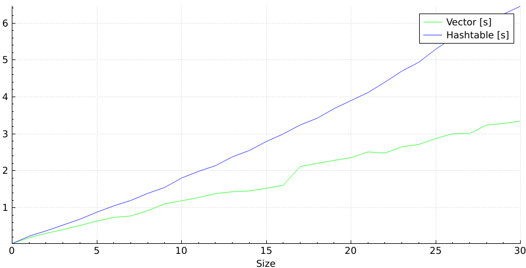

# Fake Map
This is a façade over `std::vector` that makes it act like `std::unordered_map`. This may seem like something very stupid to do, but it has some advantages over `std::unordered_map`:
* It takes significantly less memory
* It does not require the key type to have a hash function
* It preserves insertion order
* It can be faster (if indexed by `std::string`, it's faster if it contains less than about 200 elements)

## Linear complexity faster than constant? What the hell?
Vector can find elements in linear time, hashtable in constant time. That's a pretty elementary part of computer science. However, better complexity does not always mean it's faster.

Surprisingly, on GCC 9, it can be twice as fast as `std::unordered_map` with sizes around 30. If the size is large enough, the unfavourable complexity kicks in and the speed will start lagging after `std::unordered_map`. The breakpoint is around size 200. It is not as good on older compilers like MSVC 2015, where the breakpoint is only around 20.

This is the good part:

Now, why is it so? My guess is that it has something to do with memory locality, less dynamic allocation, better vectorisation possibilities and maybe speculative execution.
